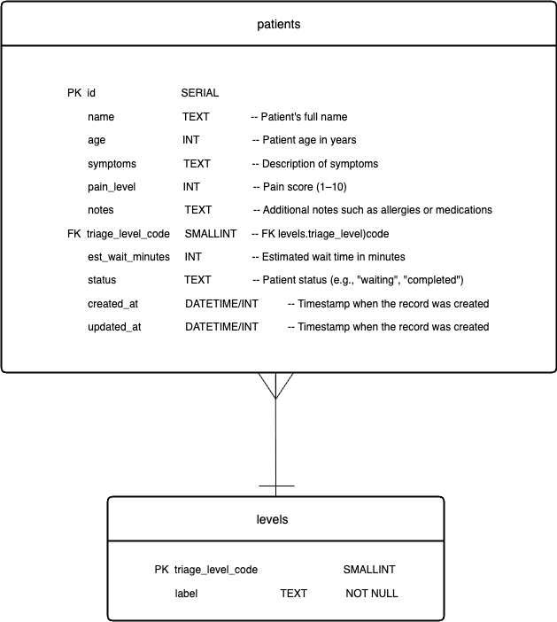

# Hospital Triage Database Design

This document describes the database schema for the **Hospital Triage Management System**.  
It includes the **entities**, their **attributes**, and the **relationships** between them.  
The goal is to support the wireframes for patient self-registration, admin triage updates, and history tracking.

---

## 1. Entities Description

### 1.1 Patients

The **patients** entity stores core patient information and their current triage status.

It contains:

- Basic demographic data (name, age)
- Clinical data (symptoms, pain level, notes)
- Operational data: current triage level code, estimated wait time, status, and timestamps.

This table is the central entity used by both the patient-facing and admin-facing screens.

---

### 1.2 Levels

The **levels**  entity represents the different triage levels used to classify patients.
It stores a short numeric code and a label such as “Level 1”, “Level 2”, or “Level 3”.
This table is referenced by the patients table via triage_level_code.

It contains:

- A numeric triage code
- A descriptive name and optional color code
- A default wait time used to estimate initial waiting times
- A description that explains the criteria for the level

This table is referenced by both **patients** and **priority_history**.

---

## 2. Attributes Specification

### 2.1 Table: `patients`

| Field              | Type        | Constraints                                                        | Description                                      |
|--------------------|------------|--------------------------------------------------------------------|--------------------------------------------------|
| `id`               | SERIAL     | PRIMARY KEY                                                        | Unique identifier for each patient               |
| `name`             | TEXT       | NOT NULL                                                           | Patient full name                                |
| `age`              | INTEGER    | CHECK (age >= 0)                                                   | Patient age in years (can be NULL if unknown)    |
| `symptoms`         | TEXT       | NULL                                                               | Description of main symptoms                     |
| `pain_level`       | INTEGER    | CHECK (pain_level BETWEEN 1 AND 10)                                | Pain score from 1 to 10                          |
| `notes`            | TEXT       | NULL                                                               | Additional notes such as allergies or medications|
| `triage_level_code`| SMALLINT   | NOT NULL, FOREIGN KEY → `levels.triage_level_code`                 | Current triage level                             |
| `estimated_wait_min` | INTEGER  | NULL                                                               | Estimated wait time in minutes                   |
| `status`           | TEXT       | NOT NULL, DEFAULT 'waiting'                                        | Patient status (e.g., `waiting`, `completed`)    |
| `created_at`       | TIMESTAMPTZ| NOT NULL, DEFAULT NOW()                                            | Timestamp when the record was created            |
| `updated_at`       | TIMESTAMPTZ| NOT NULL, DEFAULT NOW()                                            | Timestamp when the record was last updated       |
---

### 2.2 Table: `levels`

| Field              | Type      | Constraints              | Description                                      |
|--------------------|-----------|--------------------------|--------------------------------------------------|
| `triage_level_code`| SMALLINT  | PRIMARY KEY              | Numeric triage code (1, 2, 3, …)                 |
| `label`            | TEXT      | NOT NULL                 | Display label for the level (e.g., 'Level 1')    |
---

## 3. Relationships

**`levels` (1) → (M) `patients`**  
One triage level can be assigned to many patients.

---

## 4. ERD Diagram

The Entity-Relationship Diagram (ERD) for this database is stored in the repository as:

You can view it directly in GitHub.

---

## Authors

**Team Members:**
- **Tong Zhou**
- **Nha Chi Duong**

---